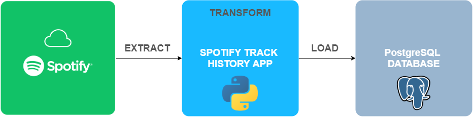
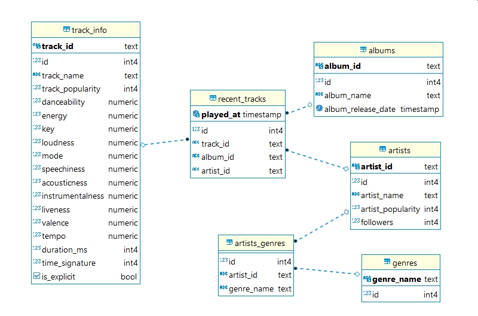

# Spotify Recently Played Tracks

**Spotify Recently Played Tracks** is an implementation of the data pipeline which extracts the recently played tracks from Spotify API and loads them into PostgreSQL database. 
The API was written from scratch for learning purposes. However, you can use Spotipy library to get the same results.

## Requirements
1. [PostgreSQL](https://www.postgresql.org/)
2. [Python 3.8+](https://www.python.org/) 
3. [Spotify for Developers App](https://developer.spotify.com/dashboard/)

## Running project
1. Set Redirect URI in your Spotify App to `http://127.0.0.1:8080/callback/q`.
2. Put your `CLIENT_ID`, `CLIENT_SECRET` and database parameters in `.env` file. It should look like this:
```
# Spotify Client Credentials
CLIENT_ID = ""                          # client id for Spotify API
CLIENT_SECRET = ""                      # client secret for Spotify API

# Database Parameters:
database = "spotify_tracks_history"     # database name
user = "postgres_spotify"               # user name
password = "oHZPuHCFgZW96^B"            # user password
host = ""                               # database host
port = "5432"                           # database port (5432 as default)
```
The `database` should correspond to the name of already existing database. 
3. The API tokens are stored in `secrets.json` file locally. To run this project, create `secrets.json` as following:
```
{
"authorization_code": "",
"access_token": "",
"token_type": "Bearer",
"expires_in": 3600,
"refresh_token": "",
"expires_at": ""
}
```
3. Install the dependencies by running `python -m pip install -r requirements.txt`.
4. Create the database and pass its name to `DB_NAME` variable in `database.py` file. Run `python database.py setup` to create the tables.
Alternatively, you can create the database manually and connect to it by modyfying `DB_NAME` variable. 

5. To authorize the client, extract the data from Spotify Web API into pandas DataFrame, transform and clean it and finally load the data into the database, run `python app.py`.

## References
This project was inspired by the following videos, webpages and repositories:
- https://www.youtube.com/watch?v=dvviIUKwH7o
- https://www.youtube.com/watch?v=xdq6Gz33khQ
- http://prokulski.science:8501/
- https://github.com/drshrey/spotify-flask-auth-example/blob/master/main.py
